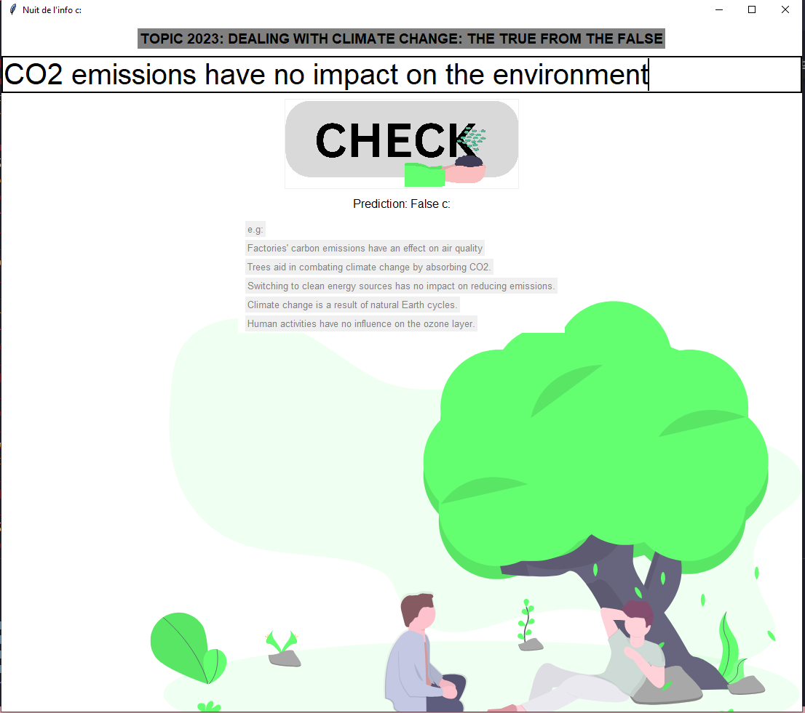
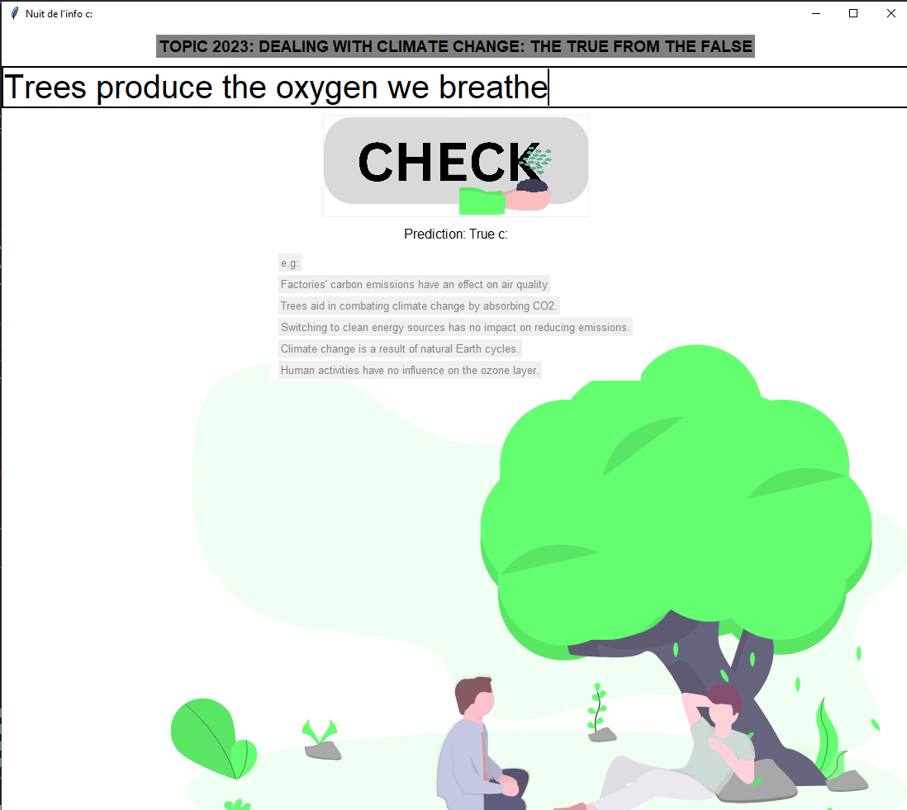

# Dealing with Climate Change: The True from the False 🌍🔍 --AI--

## Overview ℹ️
The challenge for the "Nuit de l'Info" involved addressing climate change misconceptions through an engaging and educational tool. The objective was to create an application to help individuals distinguish between false information and legitimate solutions related to climate change.

## Challenge Details 📝
- Aim: Develop a user-friendly and fun tool
- Goal: Separate misinformation from factual climate solutions
- Approach: Utilize reliable data sources and present information in a comprehensible manner
- Emphasis: Highlight effective large-scale solutions to reduce greenhouse gas emissions
- Reminder: Individual actions are important but insufficient without supportive policy measures
- Focus: Ensure ecological transition remains socially just

## Technologies and Models 🛠️
- **Language:** Python
- **Libraries:**
  - Pandas
  - Scikit-learn (for various machine learning models)
  - Tkinter (for the GUI)
  - PIL (for image handling)
- **Models Used:**
  - Logistic Regression
  - Gradient Boosting Classifier
  - Random Forest Classifier
  - K-Nearest Neighbors
  - Support Vector Machine

## Data Collection and Cleaning 🧹📊
- **Data Source:** Scraped multiple websites
- **Approach:** Employed Python and relevant libraries for data collection, cleaning, and analysis
- **Outcome:** Achieved high accuracy in understanding and cleaning the dataset

## Application Overview 📱👁️‍🗨️
- **Functionality:** Users can input statements to check their validity regarding climate change
- **Result Display:** Provides information whether the statement is likely true or false based on collected data
- **User Interface:** Designed an interactive and visually appealing GUI using Tkinter

## Contribution and Impact 🌟
- **Database Creation:** Compiled a comprehensive database from various online sources
- **Purpose:** Users can easily fact-check information related to climate change for accuracy
## Screenshots 🖼️
Here are some screenshots of our application:

### Screenshot 1

### Screenshot 2

### Screenshot 3

### Screenshot 4

## Credits 🏆
This project was developed during the international competition "La Nuit de l'Info" by:
- Meryem Barkallah
- Rahma Mghirbi
- Asma Arrak
